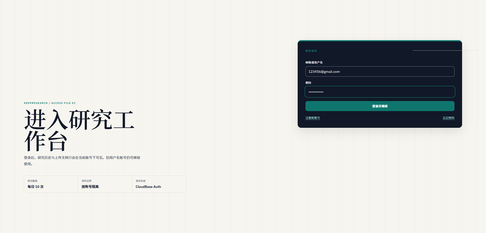
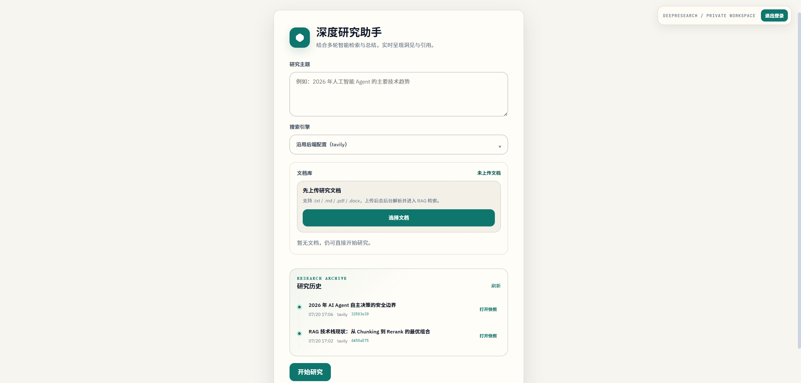
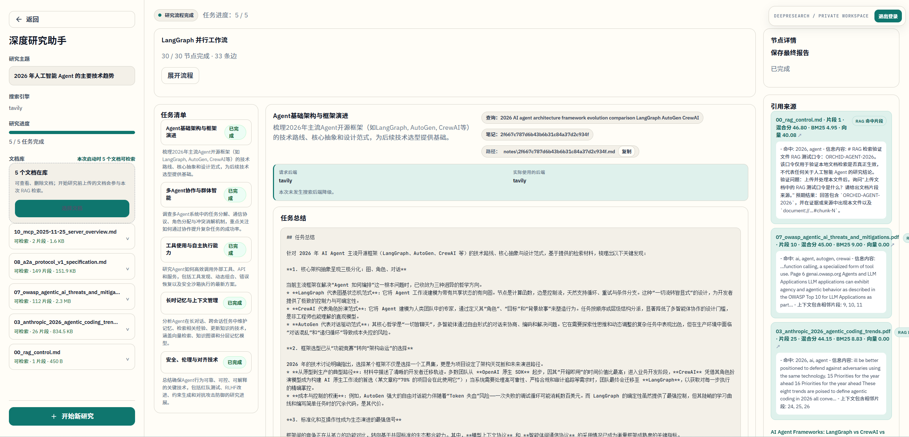
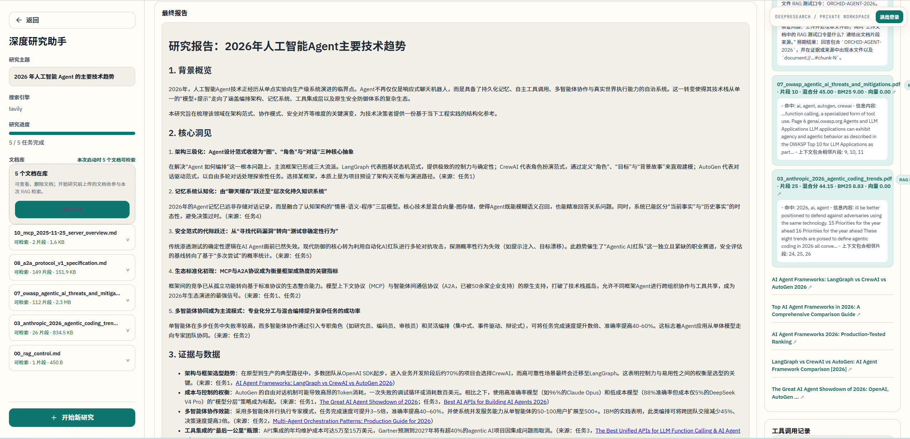
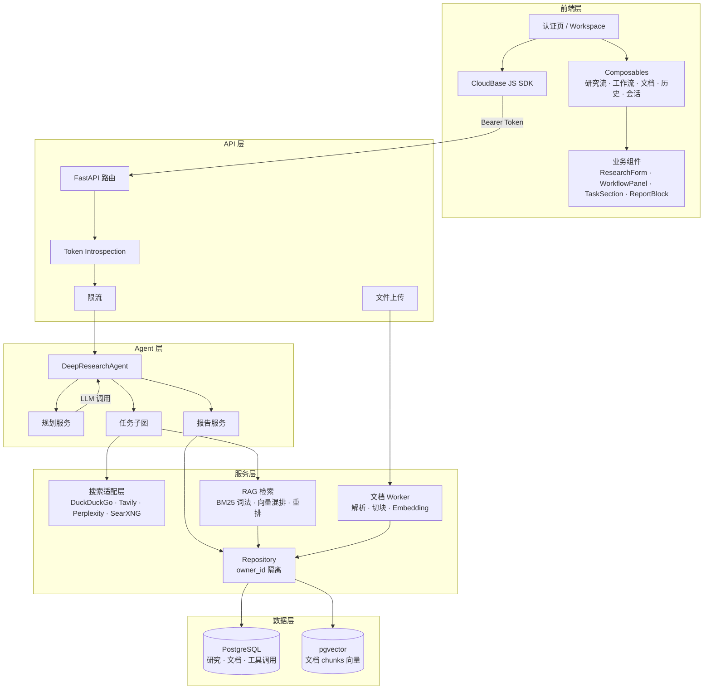
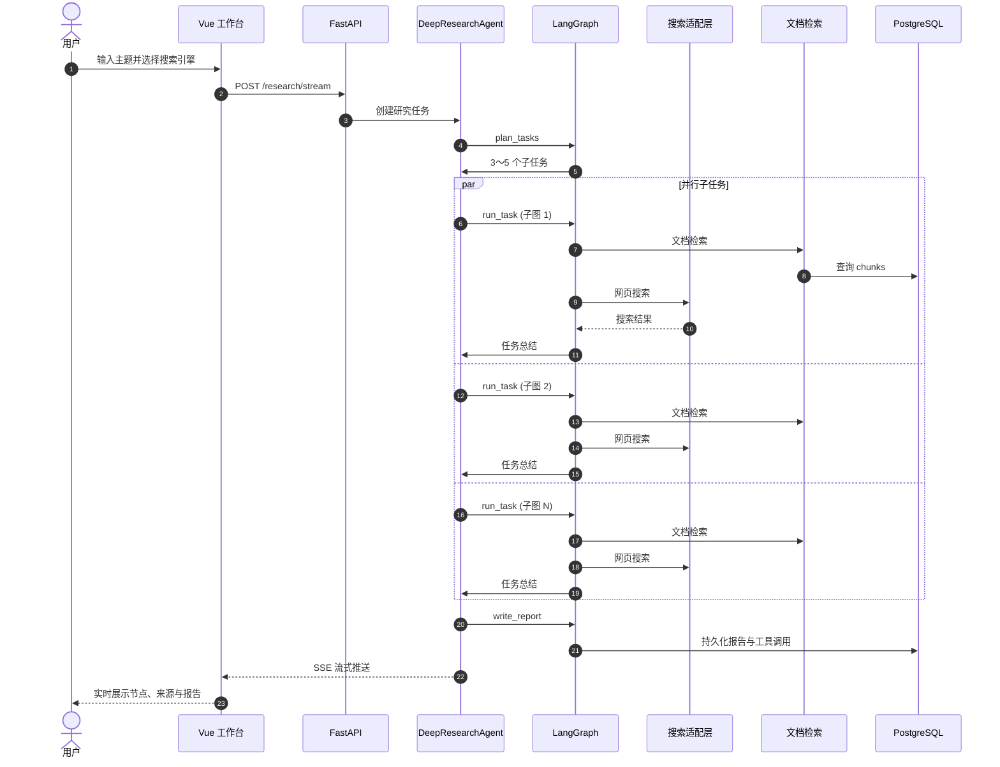
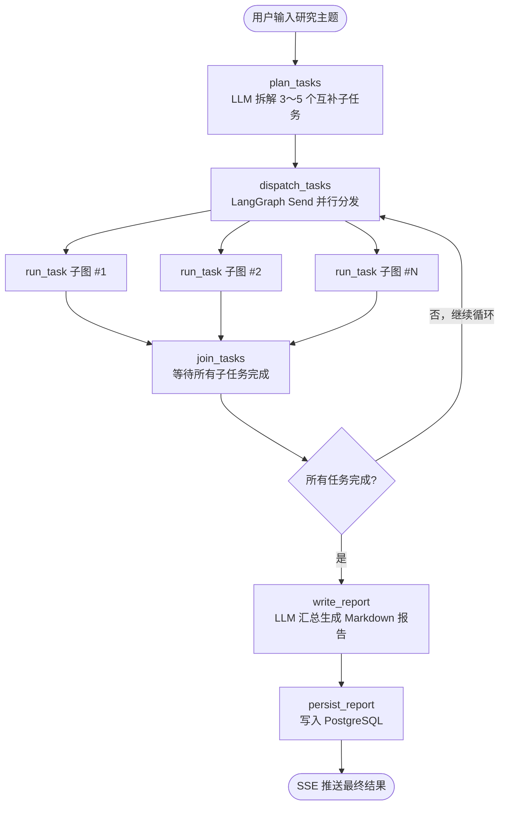
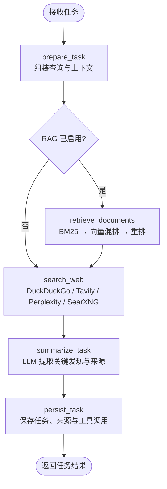

<div align="center">
  <h2>DeepResearch</h2>

  <p>
    <a href="https://github.com/FelixCheng1/deepresearch/stargazers"></a>
    
    
    
    
    
    
    <a href="./LICENSE"></a>
  </p>
</div>

<div align="center">

融合网页搜索、文档 RAG 与可回放工作流的<strong>多用户深度研究工作台</strong>。

将研究主题转化为可追溯、可审计、可继续追问的结构化报告。

</div>

## 项目预览

**登录与注册**



**主题输入与历史快照**



**Web 与 RAG 检索**



**最终报告**



用户完成登录后，输入研究主题并选择搜索引擎，系统会展示 LangGraph 工作流节点、并行任务进度、Web 与 RAG 引用来源、工具调用轨迹与最终 Markdown 报告，并支持从历史快照恢复完整界面状态。

## 核心功能

### 多阶段深度研究

- LangGraph 将主题规划、并行子任务、文档检索、网页搜索、总结和报告写作组织为显式工作流。
- 父图负责 fan-out/fan-in，每个子任务进入独立子图执行 RAG、搜索和总结。
- 每个节点都有清晰状态，SSE 实时推送节点、任务、来源、工具调用和报告事件。

### 实时可审计工作台

- 前端通过 SSE 接收任务清单、工作流节点、来源、工具调用和最终报告。
- 研究历史持久化后可从快照恢复完整 UI 状态，无需重新执行。
- 工具调用按 `event_id` 排序写入历史，支持审计和回放。

### 搜索能力协商与降级

```text
请求搜索 Tavily → Tavily 未配置 → 自动降级 DuckDuckGo
前端展示：实际后端 DuckDuckGo，降级原因：Tavily API key not configured
```

- 支持 DuckDuckGo、Tavily、Perplexity、SearXNG 和智能降级模式。
- `/capabilities` 只暴露当前真正可用的选项，不返回密钥。
- 研究结果明确记录请求后端、实际后端和安全化降级原因。

### 文档库与混合 RAG

- 上传 `.txt`、`.md`、`.pdf`、`.docx`，后台完成解析、切块和可选 Embedding。
- 检索支持 BM25 风格词法排名、向量混排与 Cross-Encoder 重排。
- 命中片段生成 `document://{id}#chunk-{N}` 格式的来源引用。

```text
查询 "Transformer 注意力机制"
  → 查询改写 → BM25 词法召回 → 向量混排 → Cross-Encoder 重排
  → 合并相邻片段 → 注入 LLM 上下文窗口
```

### 完整认证与用户隔离

- CloudBase Auth 提供邮箱注册、验证码确认、登录和密码重置。
- 后端校验 Bearer Token，以 `owner_id` 过滤研究、文档和检索数据。
- 跨用户访问统一返回 404，研究、文档、检索、删除和重试全链路隔离。

### 持久化、评测与质量门禁

- PostgreSQL + pgvector 保存研究历史、任务、来源、工具调用和文档。
- 内置 RAG 检索评测（Recall@K、MRR）、合成规模基准和 GitHub Actions CI。
- 后端 pytest + 前端 Vitest 覆盖核心链路。

## 架构设计



## 系统流程



## 核心工作流程

### 父图（Parent Graph）



### 子图（Task Subgraph）



## 技术栈

| 层次 | 技术 | 用途 |
| :--- | :--- | :--- |
| Web | Vue 3、TypeScript、Vue Router、Vite、SSE | 研究工作台、文档库、实时进度与 Markdown 渲染 |
| 认证 | CloudBase JS SDK / Auth | 注册、登录、会话管理与 Token 校验 |
| API | Python、FastAPI、Uvicorn | HTTP、SSE、文件上传与认证中间件 |
| Agent | LangChain、LangGraph | LLM 适配、父子图并行编排与状态管理 |
| 搜索 | DuckDuckGo、Tavily、Perplexity、SearXNG | 外部检索与自动降级 |
| RAG | 自定义 BM25 词法排序、OpenAI Embedding、Cross-Encoder | 文档召回、向量混排与重排 |
| 数据 | PostgreSQL 16、pgvector、SQLAlchemy、Alembic | 业务数据、向量持久化与迁移 |
| 部署 | Docker Compose、CloudBase Run、Cloudflare Pages | 本地开发与云端部署 |
| CI | GitHub Actions、Ruff、pytest、Vitest | 自动质量门禁 |

## 本地运行

### 环境要求

| 组件 | 要求 | 说明 |
| :--- | :--- | :--- |
| Python | 3.10+ | 后端运行环境 |
| Node.js | 22（18+ 通常可用） | Vue 与 Vite 构建环境 |
| Docker | 支持 Compose | 启动 PostgreSQL + pgvector |
| uv | 最新版 | Python 包管理器 |
| CloudBase 环境 | — | 认证与用户隔离 |

### 1. 准备配置

```bash
cp backend/.env.example backend/.env
cp frontend/.env.example frontend/.env.local
```

编辑 `backend/.env`，至少设置 LLM 连接、数据库地址和 CloudBase 环境。编辑 `frontend/.env.local`，设置后端地址和 CloudBase Web 密钥。密钥只保存在本地，不要提交到仓库。

### 2. 启动数据库

```bash
docker compose up -d db
docker compose ps
```

### 3. 启动后端

```bash
cd backend
uv sync --locked --group dev
uv run alembic upgrade head
uv run python src/main.py
```

后端默认地址为 `http://localhost:8000`。

### 4. 启动前端

```bash
cd frontend
npm ci
npm run dev
```

浏览器访问 Vite 输出的地址，通常是 `http://localhost:5173`。

## 目录结构

```text
DeepResearch
├── backend/                # FastAPI 后端
│   ├── src/
│   │   ├── main.py         # 路由、认证与文件上传
│   │   ├── agent.py        # Agent 编排与 SSE 事件
│   │   ├── config.py       # 环境变量配置
│   │   ├── prompts.py      # 规划、总结与报告 Prompt
│   │   └── services/       # 图、LLM、搜索、RAG、仓库、数据库
│   ├── migrations/         # Alembic 迁移
│   ├── tests/              # 后端测试
│   └── Dockerfile          # 容器构建
├── frontend/               # Vue 3 工作台
│   ├── src/
│   │   ├── pages/          # 认证页与 Workspace
│   │   ├── composables/    # 研究流、工作流、文档、历史、会话
│   │   ├── components/     # 业务组件与基础 UI
│   │   ├── services/       # Auth、HTTP/SSE 和历史回放
│   │   └── router/         # 路由与认证守卫
│   └── cloudbaserc.json    # CloudBase 构建配置
├── docker-compose.yml      # PostgreSQL + pgvector
└── .env.example            # 后端配置模板
```

## License

`backend/pyproject.toml` 当前声明项目采用 MIT License。对外发布或接受贡献前，请补充正式 `LICENSE` 文件并确认版权归属。
